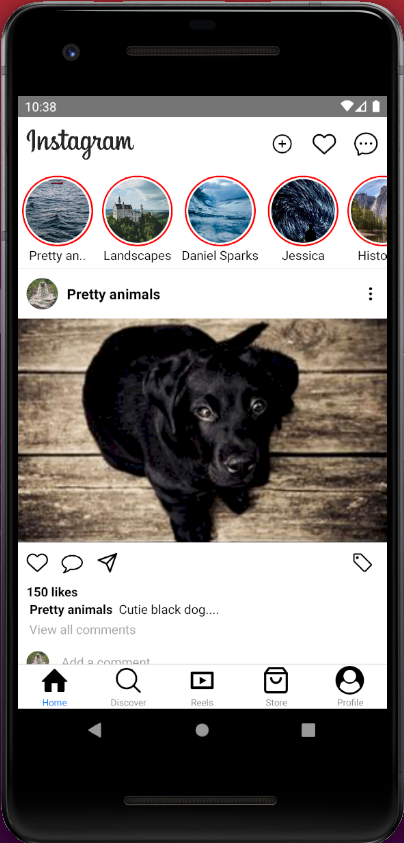
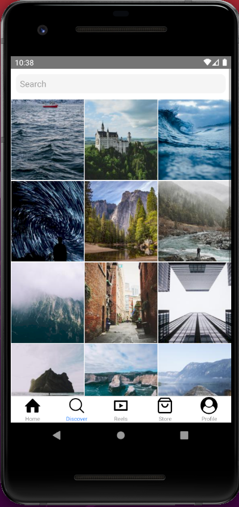

# Kodluyoruz Istanbul React Native Bootcamp Homework-Week1
 
 ### Instagram mobil uygulamasının Tab Navigasyon kullanılarak genel görünümü tasarlandı. HomePage ve DiscoverPage sayfalarının detayları tamamlandı. Veriler json dosyalarından alındı.
 
 
<div>



</div>

 

## Projenin Çalıştırılması
Proje indirildikten sonra, 'Visual Studio Code' editörü ile proje açılır. 

  Terminalde;
```
npm install

```
komut satırı ile projede kullanılan paketler "node_modules" klasöründe oluşturulur.
```
npx react-native start
```
komutu çalıştırılır.
```
npx react-native run-android
```
komutu çalıştırılır.
